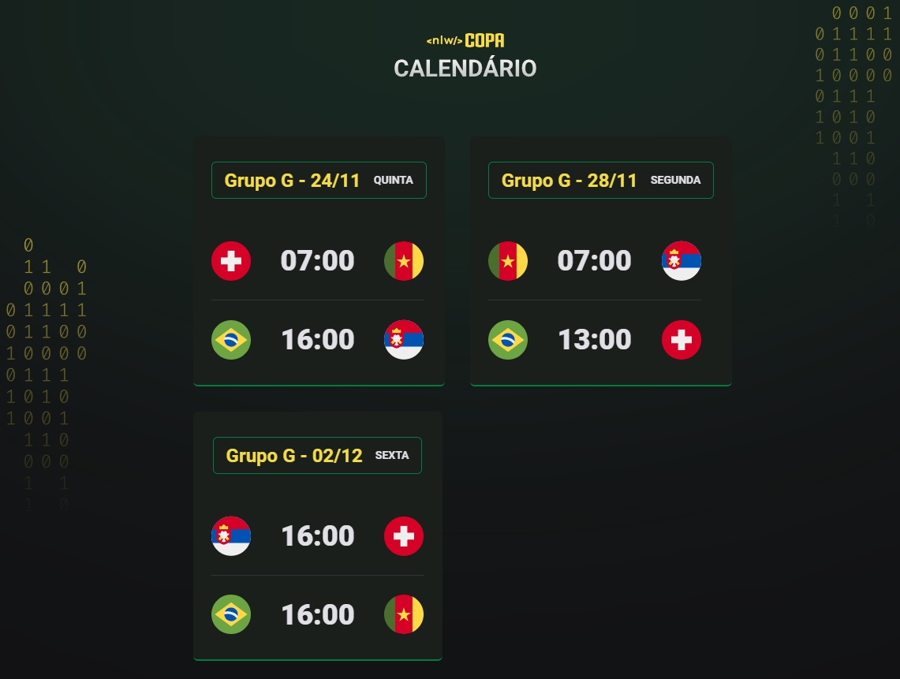

# NLW Copa - Trilha Explorer

Projeto construído no evento Next Level Week (NLW) da Rocketseat.

[📎 Clicando aqui você pode acessar esse projeto!](https://bfalconi.github.io/nlw-copa-explorer)

## 💻 Tecnologias

- HTML
- CSS
- JavaScript
- Git e Github

## 💻 Layout

Você pode visualizar o layout base do projeto através desse [link](https://www.figma.com/file/HrIaQbqencptEBH7yqi5ft/Calend%C3%A1rio-de-Jogos-(Community)?node-id=0%3A1). É necessário ter conta no Figma para acessá-lo.

## 📝 Projeto

É um projeto que apresenta o calendário da Copa do Mundo de 2022 considerando os jogos do Grupo G. A expectativa é adicionar os próximos jogos do Brasil a medida que for avançando de fase. 

## 📩 Contato

dgabrielfalconi@gmail.com